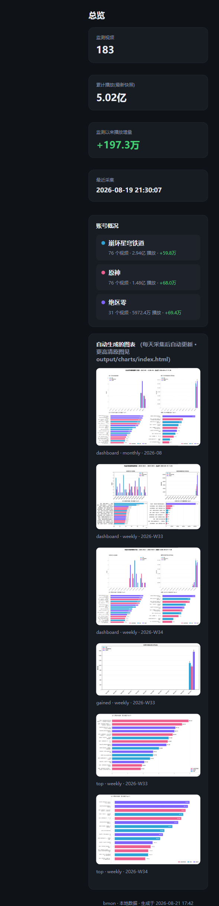
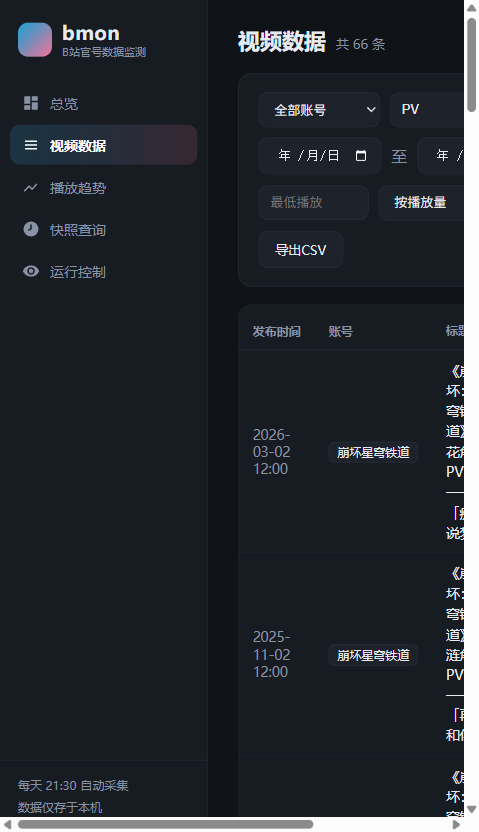

# B站官号视频播放量自动监测系统 (bmon)

全自动监测 Bilibili 账号（默认：**原神 / 崩坏星穹铁道 / 绝区零** 三个官方账号，均已核验）的全部视频播放量，
按**每周/每月**自动生成柱状图可视化，并支持按多种条件筛选视频。账号、监测间隔、图表参数等全部可通过
`config.yaml` 自定义，方便后续更换监测对象。

## 功能特性

- **自动监测**：循环拉取账号投稿清单 + 逐视频采集播放/点赞/投币/收藏/弹幕等指标快照，间隔可自定义
- **双通道投稿清单**：优先官方 `arc/search` 接口；被风控时自动切换“动态流”备选通道（游客可用），保障持续运行
- **历史深度回填**：`fetch --full` 支持游标续读，分多次把账号全部历史投稿翻完；新视频自动补齐发布时间等元数据
- **本地 Web GUI**：`python main.py gui` 一键启动浏览器控制台——总览仪表盘、视频筛选、播放趋势图、快照查询、采集控制（一键抓取/重建图表/深度回填）全部可视化操作
- **快照查询**：回看任意历史时刻的播放量，或对比任意时段的期初/期末/增量，支持筛选与 CSV 导出（CLI 与 Web 页双入口）
- **自动可视化**：每轮采集后自动生成周报/月报四宫格柱状图 PNG + 可自动刷新的 `index.html` 索引页；Top 榜标题完整折行、以颜色+图例区分游戏
- **多条件筛选**：按账号、标题关键词、发布日期区间、播放量区间、时长区间、分区、bvid 筛选，支持多种排序与 CSV 导出
- **图表联动筛选**：`chart` 命令支持与 `list` 完全相同的筛选参数，只对符合条件的视频出图
- **安全设计**：游客身份（buvid 指纹 + ExClimbWuzhi 激活）、Chrome TLS 指纹伪装、官方 WBI 签名、限速抖动、风控冷却，默认零登录态

## 项目结构

```
bilibili-monitor/
├── main.py            # 命令行入口 (fetch/run/chart/list/snapshot/gui …)
├── config.yaml        # 个人配置 (首次复制 config.example.yaml 或 init 生成, 不入库)
├── run.bat            # 双击即持续运行 (Windows)
├── requirements.txt
├── bmon/
│   ├── api.py         # B站API客户端: WBI签名/双通道/身份激活/限速退避
│   ├── storage.py     # SQLite 存储 (账号/视频/快照/游标)
│   ├── monitor.py     # 采集调度: 单轮 fetch 与持续循环 run
│   ├── filters.py     # 多条件筛选与表格/CSV输出
│   ├── charts.py      # 周/月柱状图 + index.html
│   ├── webui.py       # 本地 Web GUI (Flask, 仅监听 127.0.0.1)
│   ├── config.py      # 配置加载与默认模板
│   └── util.py
├── templates/         # Web GUI 页面模板 (总览/视频/趋势/快照/控制)
├── static/            # Web GUI 样式与 echarts
├── docs/              # 进度报告与方案文档
├── data/
│   ├── monitor.db     # SQLite 数据库
│   ├── monitor.log    # 运行日志
│   └── state.json     # 最近一轮运行状态
└── output/charts/     # 自动生成的图表 PNG 与 index.html
```



## 快速开始

```bash
cd bilibili-monitor
python -m venv .venv
.venv\Scripts\pip install -r requirements.txt

# 首次使用: 复制配置模板 (或用 init 生成默认配置)
copy config.example.yaml config.yaml

.venv\Scripts\python main.py accounts    # 联网核验配置中的账号
.venv\Scripts\python main.py fetch       # 执行一轮采集(自动发现近期投稿)
.venv\Scripts\python main.py gui         # 打开本地 Web GUI (推荐, 采集/查看全可视化)
.venv\Scripts\python main.py run         # 或: 持续自动监测(间隔见配置, Ctrl+C 停止)
```

或者 Windows 下直接双击 `run.bat` 持续运行。

查看图表：用浏览器打开 `output/charts/index.html`（默认每 5 分钟自动刷新），
或运行 `python main.py gui` 在 Web GUI 总览页直接查看。

## 本地 Web GUI

```bash
python main.py gui                # 默认 http://127.0.0.1:8322 并自动打开浏览器
python main.py gui --port 9000 --no-browser
```

仅监听本机回环地址，数据不出本机，无需鉴权。五个页面：

| 页面 | 功能 |
|---|---|
| 总览 | 视频数/累计播放/增量统计卡片、账号概况、自动图表列表 |
| 视频数据 | 与 `list` 同套筛选条件 + 分页 + CSV 导出 |
| 播放趋势 | 任选 1-2 个视频，ECharts 播放量/点赞趋势曲线对比 |
| 快照查询 | 任意时刻/时段的历史播放量，见下节 |
| 运行控制 | 一键立即采集/重建图表/深度回填历史，实时查看运行日志 |



## 快照查询（任意时刻/时段的历史播放量）

快照从开始监测起逐轮积累，可回看历史上任意时刻的数据：

```bash
# 某时刻各视频的播放量
python main.py snapshot --at "2026-08-19 21:00"

# 某时段的期初/期末/增量对比, 支持 list 全部筛选参数与 CSV 导出
python main.py snapshot --from "2026-08-18 00:00" --to "2026-08-20 21:00" --account 绝区零 --csv delta.csv
```

Web GUI 的「快照查询」页提供同样的能力（时刻/时段切换、筛选、排序、CSV 导出）。

## 每日定时自动采集（已配置）

系统已注册 Windows 计划任务 **`BiliMonDailyFetch`**：**每天 21:30** 自动执行一轮采集
（`daily_fetch.bat` → `main.py fetch`：增量拉取三账号投稿 + 活跃窗口指标快照 + 自动重建图表），
并已开启"错过补跑"（如 21:30 关机，登录后自动补执行）与电池模式可运行。
输出日志：`data/monitor.log` 与 `data/scheduled.log`。

管理命令（Git Bash 需加 `MSYS_NO_PATHCONV=1` 前缀，PowerShell/CMD 直接可用）：

```bash
schtasks /Query /TN BiliMonDailyFetch /V /FO LIST      # 查看任务与下次运行时间
schtasks /Run    /TN BiliMonDailyFetch                 # 立即手动执行一次
schtasks /Change /TN BiliMonDailyFetch /ST 09:00       # 改为每天 09:00
schtasks /Delete /TN BiliMonDailyFetch /F              # 删除定时任务
```

注意：该任务以当前用户"登录时运行"方式注册（无需管理员权限）；若需关机时段也执行，
可在任务计划程序中勾选"不管用户是否登录都要运行"（需输入密码）。
想要更高频次的持续监测（如每小时），随时运行 `run.bat` 或 `python main.py run`，
间隔由 `config.yaml` 的 `interval_minutes` 控制，与每日任务互不冲突。

**补充完整历史（可选）**：首轮采集会拿到最近的投稿；如需回填更早的历史，多次执行
`python main.py fetch --full`（每次自动从上次游标继续，直到日志提示"已翻完全部历史"）。

## 命令一览

| 命令 | 说明 |
|---|---|
| `init` | 生成默认配置文件 |
| `find --keyword 名称` | 联网搜索B站用户，查询 mid（添加账号用） |
| `accounts` | 核验配置中的账号（昵称/粉丝数/库内视频数） |
| `fetch [--full]` | 执行一轮采集；`--full` 深度回填历史（游标续读） |
| `run [--interval-minutes 30]` | 持续监测循环；可临时覆盖间隔；`--max-cycles n` 调试用 |
| `chart` | 手动生成图表（见下） |
| `list` | 按条件筛选视频（见下） |
| `snapshot` | 查询任意时刻/时段的历史播放量快照（见上节） |
| `gui` | 启动本地 Web GUI（`--port` / `--no-browser`） |
| `state` | 查看最近一轮运行状态 |

### 图表生成

```bash
python main.py chart --period weekly --type dashboard   # 周报仪表盘(默认 both+dashboard)
python main.py chart --period monthly --type gained     # 月度播放增量柱状图
python main.py chart --period weekly --type top         # 近N周发布视频累计播放Top
python main.py chart --account 原神 --keyword PV        # 只对筛选后的视频出图
```

- `--period`: `weekly` / `monthly` / `both`
- `--type`: `dashboard`(四宫格: 每期发布数 / 每期播放增量 / 累计播放Top / 本期增长Top)
  `published` / `gained` / `top` 单图
- `--periods-back N`: 展示最近 N 个周期（默认取配置 12）

### 视频筛选

```bash
# 播放量最高的前20个视频
python main.py list --sort views --limit 20

# 原神账号标题含"PV"的视频
python main.py list --account 原神 --keyword PV

# 今年以来播放破千万、时长超过5分钟、按增长排序并导出CSV
python main.py list --since 2026-01-01 --min-views 10000000 --min-seconds 300 --sort growth --csv top.csv

# 多账号 / 指定bvid / 分区 / 日期区间
python main.py list --account 原神,绝区零
python main.py list --since 2026-06-01 --until 2026-08-01 --sort pubdate
python main.py list --bvid BV1sxui6eEGH
```

筛选参数（`list` 与 `chart` 通用）：`--account`(可多次/逗号分隔)、`--keyword`、`--since/--until`、
`--min-views/--max-views`、`--min-seconds/--max-seconds`、`--tname`、`--bvid`、
`--sort pubdate|views|likes|growth|duration`、`--asc`、`--limit`。

其中 `growth`(增长) = 最新快照播放 − 首次快照播放，即开始监测以来的播放增量（需运行至少两轮）。

## 自定义配置 (config.yaml)

### 更换/添加监测账号

```yaml
accounts:
  - mid: 401742377        # 原神
    name: 原神
    enabled: true
  - mid: 1340190821       # 崩坏星穹铁道
    name: 崩坏星穹铁道
    enabled: true
  - mid: 1636034895       # 绝区零
    name: 绝区零
    enabled: true
  # 新增任意账号: 用 `python main.py find --keyword 昵称` 查 mid 后照抄一段即可
  # 暂停某账号: enabled: false
  # 仅监测指定视频(手动模式, 不再拉取全部投稿):
  # - mid: 123456
  #   name: 某账号
  #   bvids: ["BV1xx411c7mD", "BV1ab411c7ba"]
```

### 监测参数

| 键 | 默认 | 说明 |
|---|---|---|
| `interval_minutes` | 60 | 监测间隔（分钟，支持小数） |
| `request_interval_seconds` | 2.5 | 相邻请求最小间隔（限速，建议 ≥2） |
| `active_days` | 45 | 仅对最近 N 天发布的视频逐周期采集指标（0=全部，请求量大） |
| `stats_mode` | full | `basic`=仅列表接口；`full`=逐视频详情（含点赞/投币等） |
| `listing_mode` | auto | 投稿清单通道：`auto`=arc优先/风控自动切动态流；可强制 `arc`/`feed` |
| `use_system_proxy` | false | 是否走系统代理（**默认直连**；数据中心代理出口 IP 会被B站风控拦截） |
| `feed_page_interval_seconds` | 5 | 动态流通道翻页间隔（该接口对频率敏感，建议 ≥5） |
| `meta_backfill_limit` | 300 | 每轮为新发现视频回填详情的最大数量（0=不限） |
| `backfill_pages` | 0 | 首次抓取最多翻页数（每页50条，0=不限，仅 arc 通道） |
| `cookie` | 空 | 可粘贴浏览器 Cookie（含 SESSDATA）提升数据权限；留空=游客模式 |

### 图表参数

`auto`(自动出图)、`periods`(自动生成哪些周期)、`periods_back`(展示周期数)、`top_n`、
`output_dir`、`font`(中文字体，留空自动探测微软雅黑)、`auto_refresh_seconds`(索引页自动刷新)。

## 反爬与安全设计说明

本系统仅采集**公开数据**、以**个人研究**为目的，通过以下设计将对站方的干扰与自身风险降到最低：

1. **零登录态**：默认使用游客身份，通过官方指纹接口获取 buvid，并按官方 web 端流程完成
   ExClimbWuzhi 设备指纹上报激活，全程不涉及任何账号
2. **浏览器级伪装**：curl_cffi 模拟 Chrome 的 TLS/JA3 指纹 + 真实浏览器请求头，
   投稿列表接口按官方 WBI 算法签名并携带 web 端设备参数
3. **双通道容错**：arc/search 被风控时自动切换动态流通道并翻页限速（5秒+/页），
   触发风控先冷却再重建游客身份重试，绝不硬刷
4. **限速 + 抖动**：请求间隔 ≥2.5 秒并附加 ±15% 随机抖动；动态流接口单独更长间隔
5. **增量优化**：常规轮次只翻到已入库的旧视频即停止；深度回填支持游标断点续读
6. **直连优先**：默认绕过系统代理——数据中心/海外代理出口 IP 会被B站风控重点拦截
   （本机测试验证：代理出口被 412/-352 拦截，直连家宽正常）
7. **合规建议**：保持 `interval_minutes` ≥ 30；数据版权归 B 站与相应 UP 主，请勿商用或批量分发

若个别视频播放量显示为 `-`（如充电专属视频对游客隐藏播放量），属正常现象，可配置 `cookie` 解决。

## 常见问题

- **首轮 `fetch` 要多久？** 动态流通道下三个官号约 50-60 分钟（受限速保护与B站对游客的
  连续翻页限制，单次约能翻 50-60 页，覆盖最近数月的投稿）；arc 通道可用时只需几分钟。
- **怎么补全更早的历史投稿？** 多执行几次 `python main.py fetch --full`，每次从上次游标
  继续向历史翻页，直到日志显示"已翻完全部历史"。历史播放量只能从开始监测时记录。
- **图表"播放增量/增长"为空？** 增量按快照差值计算，需系统运行跨越至少两个采集周期；
  之后每个周期都会自动积累。
- **日志出现 412/-352 风控？** 属预期行为：系统会自动冷却、重建身份或切换通道；若持续
  出现，检查是否走了代理（配置 `use_system_proxy: false` 直连）或调大请求间隔。
- **想开机自动运行？** Windows 任务计划程序 → 创建基本任务 → 触发器"登录时" →
  操作启动 `run.bat`（或 `pythonw main.py run` 后台运行，日志见 `data/monitor.log`）。
- **数据存在哪？** 全部本地：`data/monitor.db`（SQLite，可用任意工具查询 `videos` / `snapshots` 表）。

## 免责声明

本工具仅供学习与个人数据研究，请合理控制采集频率并遵守 Bilibili 用户协议；
请勿用于商业用途或大规模分发数据。

## 许可证

[MIT](LICENSE) © kyo-zzz
