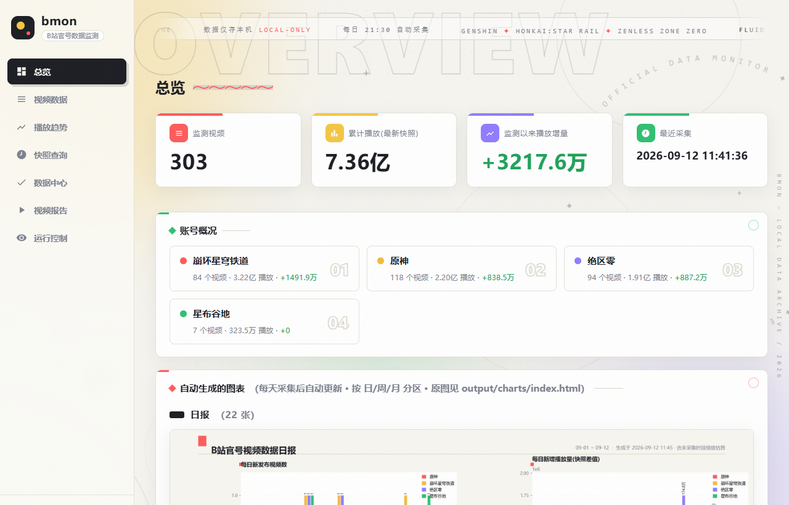
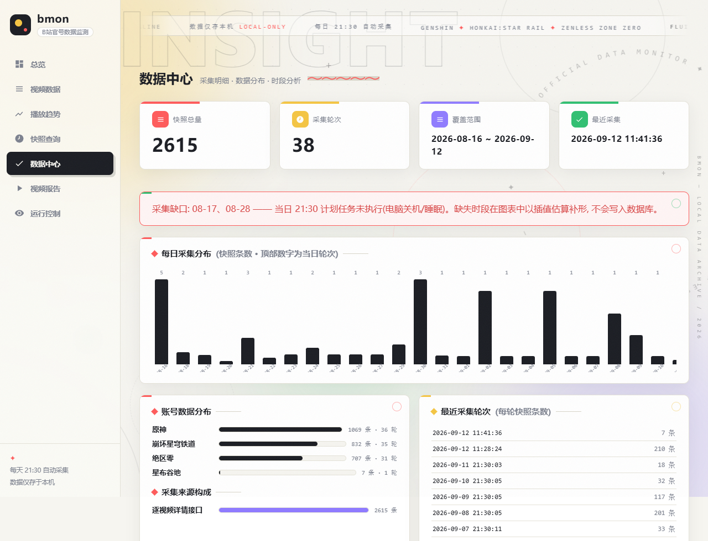
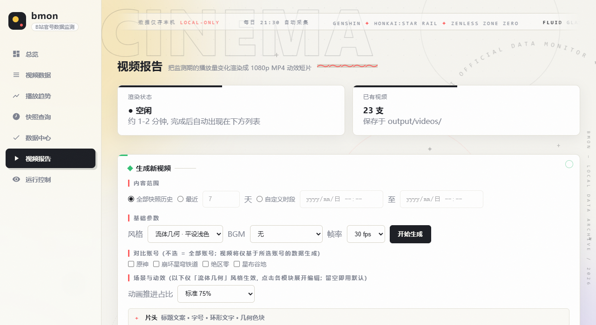
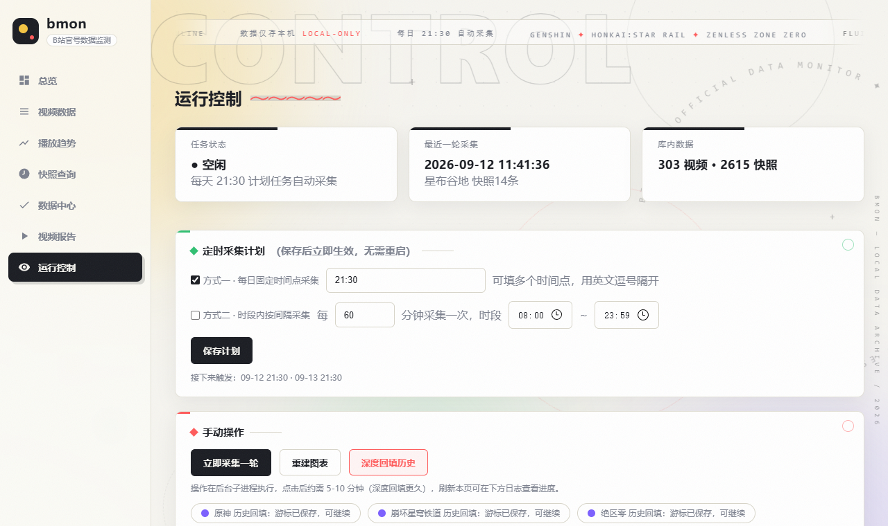
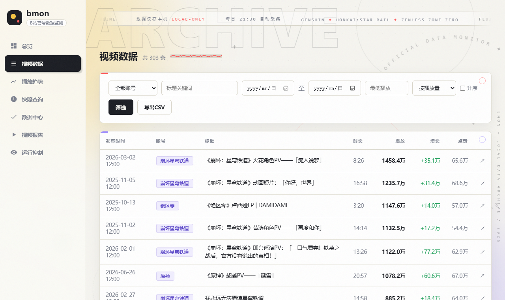

# B站官号视频播放量自动监测系统 (bmon)

全自动追踪 Bilibili 游戏官号（内置 **原神 / 崩坏：星穹铁道 / 绝区零 / 星布谷地** 四个官方账号，
均可自定义增删）的全部投稿播放数据：每日定时采集入库、按日/周/月自动出图、
在浏览器里查询任意时刻的历史数据、一键生成带 BGM 的数据报告视频——全程零登录态、纯本地运行。

| 总览仪表盘 | 数据中心 |
|---|---|
|  |  |

## 功能特性

### 数据采集（无人值守）
- **双通道投稿清单**：官方 `arc/search` 接口优先，被风控时自动切换动态流通道兜底；
  官方 WBI 签名 + 游客身份激活（ExClimbWuzhi），全程**零登录态**
- **每日定时采集**：Web GUI 可配置"每日固定时间点"与"时段内按间隔"两种计划，
  修改即时生效；错过自动补跑；另有 Windows 计划任务兜底（`BiliMonDailyFetch`）
- **老视频翻红监测**：日常只采近 45 天活跃窗口，每 3 天自动对所有入库视频全量扫描一轮
  （`full_sweep_days` 可调），配合深度回填游标续读，历史投稿目录完整补全
- **失败自动重试**：某账号当轮被风控跳过时，10 分钟后自动仅重试该账号；
  多套触发机制（计划任务/GUI 调度器/命令行）经跨进程互斥锁并存不冲突
- **数据健壮性**：SQLite WAL 并发读写、每轮自动备份（保留最近 N 份）、日志轮转

### 数据展示（纸感平设设计系统）
- **本地 Web GUI**（七个页面，仅监听 127.0.0.1）：
  总览仪表盘 / 视频数据筛选 / 播放趋势对比 / 快照查询 / **数据中心** / **视频报告** / 运行控制
- **数据中心**：采集轮次与每日分布、账号与来源构成、缺口警示、
  按日/周/月的时段增量分析、发布时间习惯、人工撰写的分析评论
- **快照查询**：回看任意历史时刻的播放量，或对比任意时段的期初/期末/增量，支持筛选与 CSV 导出
- **自动图表**：每轮采集后自动重建 日/周/月 四宫格仪表盘（按周期分目录归档），
  未采集到的当日数据自动插值补形（仅展示不入库）
- **多条件筛选**：账号、标题关键词、发布日期区间、播放量/时长区间、分区、bvid，
  多种排序 + CSV 导出；CLI 与 Web 共用同一套筛选语义

### 数据视频（1080p MP4）
- **两种视觉风格**：`fluid` 流体几何平设（默认，浅色纸感 + 描边底字 + 平涂色块 +
  环形文字 + 辉光曲线）与 `classic` 经典深色版
- **八幕结构**：片头 → 总览(数字滚动/分游戏/时间轴) → 播放走势 → 净增量·视频 →
  **净增量·近期视频**(过滤老视频，不足自动回溯) → 播放量竞跑 → 片尾
- **折线扫描先快后慢缓动**，右侧标签跟随折线端点、数值连续跳字
- **BGM 踩点合成**：把音频丢进 `bgm/` 文件夹即可在 GUI 下拉选择——每首 BGM
  自动分析节拍并缓存标记（免重算），各幕边界吸附最近节拍、视频总时长跟随 BGM、
  渲染后自动合成音轨（末端淡出）
- **GUI 折叠面板逐幕调参**：每幕时长、Top N、线宽、标签折行宽、纵轴缓冲、
  截断阈值、条形高度、片头文案、动画推进占比……留空即用默认



### 运行控制（Web GUI 内）
一键立即采集 / 重建图表 / 深度回填历史；实时运行日志；
定时采集计划表单；账号对比多选；BGM 选择。



## 快速开始

```bash
cd bilibili-monitor
python -m venv .venv
.venv\Scripts\pip install -r requirements.txt

copy config.example.yaml config.yaml          # 首次使用复制配置模板

.venv\Scripts\python main.py accounts         # 联网核验配置中的账号
.venv\Scripts\python main.py fetch            # 执行一轮采集
.venv\Scripts\python main.py gui              # 打开本地 Web GUI (推荐)
```

Windows 下双击 `open_gui.bat` 一键打开 Web GUI（含定时调度，关窗即停），
或 `run.bat` 进入持续监测循环；每日定时也可只依赖 Windows 计划任务（见下文）。

## 命令一览

| 命令 | 说明 |
|---|---|
| `init` | 生成默认配置文件 |
| `find --keyword 名称` | 联网搜索B站用户，查询 mid（添加账号用） |
| `accounts` | 核验配置中的账号（昵称/粉丝数/库内视频数） |
| `fetch [--full] [--only-mid MID]` | 执行一轮采集；`--full` 深度回填历史；`--only-mid` 仅采指定账号 |
| `run [--interval-minutes N]` | 持续自动监测循环 |
| `chart [--period daily/weekly/monthly/all]` | 手动生成图表（支持筛选参数联动） |
| `list` | 按条件筛选视频（支持 CSV 导出） |
| `snapshot --at 时刻 / --from --to` | 查询任意时刻/时段的播放量快照 |
| `backup [--keep N]` | 手动备份数据库 |
| `gui [--port] [--no-browser]` | 启动本地 Web GUI |
| `scheduler` | 常驻定时采集调度（不开 GUI 也能调度） |
| `video [--days N / --from --to] [--style fluid/classic] [--bgm 文件] [--mids 列表]` | 生成数据报告视频 |
| `state` | 查看最近一轮运行状态 |

## 本地 Web GUI

```bash
python main.py gui                # 默认 http://127.0.0.1:8322 并自动打开浏览器
python main.py gui --port 9000 --no-browser
```

| 页面 | 功能 |
|---|---|
| 总览 | 视频/播放/增量统计卡、账号概况、自动图表（日/周/月分区） |
| 视频数据 | 全部筛选条件 + 分页 + CSV 导出 |
| 播放趋势 | 任选 1-2 个视频，播放量/点赞趋势曲线对比 |
| 快照查询 | 指定时刻 / 时段对比两种模式，任意筛选组合 |
| 数据中心 | 采集总览(轮次/分布/缺口警示) + 日/周/月数据分析 + 分析评论 |
| 视频报告 | 在线生成数据视频(风格/时段/帧率/逐幕参数折叠面板/对比账号/BGM) + 历史预览下载 |
| 运行控制 | 一键采集/重建图表/深度回填，实时日志，定时采集计划表单 |



## 快照查询（任意时刻/时段的历史播放量）

```bash
python main.py snapshot --at "2026-09-10 21:00"                    # 某时刻全部视频的播放量
python main.py snapshot --from "2026-09-05" --to "2026-09-11" --csv out.csv
```

Web「快照查询」页提供同样能力（指定时刻 / 时段对比两种模式 + 全部筛选）。
快照随每日采集积累，是折线趋势、净增量动画与竞跑的数据底座。

## 数据变化视频（1080p MP4）

```bash
python main.py video                              # 流体几何风(默认), 全部快照历史
python main.py video --days 7 --style classic     # 经典深色版
python main.py video --mids 1340190821,1636034895 # 仅基于指定账号(账号对比)
python main.py video --bgm bgm/我的BGM.mp3        # 合成 BGM 并踩点
python main.py video --scene bars=12 --sweep-frac 0.6   # 逐幕调参
```

- **fluid**（默认）：纸感平设浅色——描边底字、平涂色块、环形文字、辉光曲线、
  圆角条形竞跑；折线扫描先快后慢缓动，右侧标签跟随折线端点、数值连续跳字
- **classic**：初代深色版，`--style classic` 或配置 `video.style` 切换
- 时间轴**按日期均匀分格**（每天一格），末端=末时间，折线从起点画起
  （净增量幕首快照前贴轴为零）；净增量·近期幕仅收录发布于数据跨度×2 内的视频
- GUI「视频报告」页提供全部参数的折叠面板（每幕时长/Top N/线宽/文案/BGM/对比账号），
  生成后在线预览与下载

## 定时采集

打开 Web GUI「运行控制」页配置（两种方式独立启用）：

- **方式一 · 每日固定时间点**：如 `08:30, 21:30`（可多个）
- **方式二 · 时段内按间隔**：每 N 分钟一次，限定起止时段

保存即时生效（存于 `data/schedule.json`，调度循环实时重读）；
GUI 关闭时可单独运行 `python main.py scheduler` 常驻调度。
另有 Windows 计划任务 **`BiliMonDailyFetch`**（每天 21:30，开启错过补跑）兜底。

采集入口有**跨进程互斥锁**：上述机制同时触发时同一时刻只跑一轮，不会重复。
某账号当轮被风控跳过时，10 分钟后自动**仅重试该账号**。

## 自定义配置 (config.yaml)

### 账号

```yaml
accounts:
  - mid: 401742377        # 原神
    name: 原神
    enabled: true
  - mid: 1340190821       # 崩坏：星穹铁道
    name: 崩坏：星穹铁道
    enabled: true
  # 星布谷地 / 任意其他账号: 用 `python main.py find --keyword 昵称` 查 mid 后照抄一段
  # enabled: false 暂停账号; bvids: [...] 可只监测指定视频
```

### 关键参数

| 键 | 默认 | 说明 |
|---|---|---|
| `active_days` | 45 | 活跃窗口：仅对最近 N 天发布的视频逐周期采集 |
| `full_sweep_days` | 3 | 每 N 天对所有入库视频全量采集一轮（老视频翻红监测，0=关闭） |
| `listing_mode` | auto | 投稿清单通道：arc 优先 / 风控自动切动态流 |
| `use_system_proxy` | false | 是否走系统代理（**默认直连**，代理出口 IP 会被风控） |
| `interpolate` (charts) | true | 图表对未采集到的当日数据插值补形（仅展示不入库） |
| `backup_keep` (storage) | 5 | 自动备份保留份数 |
| `cookie` | 空 | 浏览器 Cookie（含 SESSDATA），留空=游客模式 |

完整参数见 `config.example.yaml` 内注释。

## 图表

```bash
python main.py chart --period all --type dashboard   # 日+周+月仪表盘全部重建
python main.py chart --period weekly --type gained   # 单图: 每周播放增量
python main.py chart --account 原神 --keyword PV     # 只对筛选后的视频出图
```

- 仪表盘四宫格：每期新发布视频数 / 每期播放增量 / 累计播放 Top / 本期增长 Top
- 未采集到的当日数据由**插值估算**补形（标题会注明"含插值估算"，仅展示不入库）
- 输出按周期归档：`output/charts/{daily,weekly,monthly}/`，
  根目录 `index.html` 分区汇总（自动刷新）

## 反爬与安全设计

1. **零登录态**：游客身份（官方指纹接口 + ExClimbWuzhi 设备激活），不涉及任何账号
2. **浏览器级伪装**：curl_cffi 模拟 Chrome TLS 指纹 + 官方 WBI 签名 + web 端设备参数
3. **双通道容错**：arc/search 被风控自动切动态流；限速 ≥2.5s/请求 + 随机抖动，
   风控先冷却重建身份再重试，绝不硬刷
4. **直连优先**：默认绕过系统代理（实测数据中心/海外代理出口 IP 会被B站重点拦截）
5. **合规建议**：保持低频采集；数据版权归 B 站与相应 UP 主，请勿商用或批量分发

## 项目结构

```
bilibili-monitor/
├── main.py               # CLI 入口 (fetch/run/chart/list/snapshot/video/gui/scheduler/backup…)
├── config.yaml           # 个人配置 (首次复制 config.example.yaml)
├── run.bat / open_gui.bat / daily_fetch.bat
├── bmon/
│   ├── api.py            # B站API客户端 (WBI签名/双通道/游客激活/限速退避)
│   ├── storage.py        # SQLite (WAL/账号/视频/快照/游标/采集统计)
│   ├── monitor.py        # 单轮采集与持续循环 (互斥锁/全量扫描/失败记录)
│   ├── scheduler.py      # 定时调度 (双模式/补跑/失败重试)
│   ├── filters.py        # 多条件筛选与表格/CSV
│   ├── charts.py         # 日/周/月四宫格仪表盘 (纸感平设)
│   ├── interp.py         # 展示用插值估算
│   ├── video.py          # 数据视频·经典深色版
│   ├── video_fluid.py    # 数据视频·流体几何平设版
│   ├── bgm.py            # BGM 节拍分析与场景对齐
│   ├── webui.py          # 本地 Web GUI (Flask)
│   ├── lock.py / backup.py / config.py / util.py
├── templates/ + static/  # Web GUI 页面与样式 (纸感平设设计系统)
├── tests/                # 单元测试 (pytest, 20 例)
├── .github/workflows/    # CI (编译检查 + 测试)
├── bgm/                  # BGM 音频库 (丢入即可在 GUI 选择)
├── data/                 # monitor.db / 备份 / 日志 / 计划 / 调度状态
├── output/charts/        # 自动图表 (daily/weekly/monthly + index.html)
├── output/videos/        # 生成的数据报告 MP4
└── docs/                 # 进度报告 / 部署与视频方案 / 截图
```

## 常见问题

- **首轮采集要多久？** 动态流通道约 10-15 分钟覆盖近期投稿（B站对游客单次翻页有限制）；
  更早历史用 `fetch --full` 游标续读，多次执行直至"已翻完全部历史"
- **某天数据缺了？** 多为电脑在采集时刻关机/睡眠。数据中心页会列出缺口日期并警示；
  图表对这些时段插值补形；Windows 计划任务与调度器补跑机制会尽量自动挽回
- **老视频会监测吗？** 会——每 3 天全量扫描一轮所有入库视频（`full_sweep_days`），
  更早历史用 `fetch --full` 持续回填
- **视频想要不同风格/节奏？** 「视频报告」页逐幕折叠面板调参，或换 BGM（分镜自动踩点）
- **数据存在哪？** 全部本地：`data/monitor.db`（SQLite），自动备份在 `data/backup/`

## 免责声明

本工具仅供学习与个人数据研究，请合理控制采集频率并遵守 Bilibili 用户协议；
请勿用于商业用途或大规模分发数据。

## 许可证

[MIT](LICENSE) © kyo-zzz
